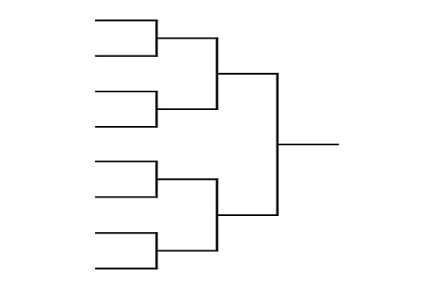

Are you searching for a package to show your matchups in a heirarchical way. Then you have landed in the right place.

<div align="center">
  
</div>

# TournamentBracketView
It is a package to show the matchups in a beautiful bracket view. Developed fully using SwiftUI framework.

# Why TournamentBracketView?
* Highly customisable
* Tab support to switch
* Regular updates

# Xcode Package Dependency:

Use the following link to add TournamentBracketView as a Package Dependency to an Xcode project:

```
https://github.com/manisrini/TournamentBracketSUI
```

# Platform support:
* iOS 17

# Configuration :

TournamentBracketView is a swiftUI view that generates bracket view. It requires three params.

``` TournamentBracketView(viewModel : TournamentBracketViewModel,showTabSwitch : Bool,theme: TournamentBracketTheme) ```

## Brief summary about parameters:

*viewModel : TournamentBracketViewModel*

It requires tournament param. Below is the model shown.

```
public struct Tournament{
    let rounds : [Round]
}

public struct Round {
    let id : Int
    let matchUps : [Matchup]
}

public struct Matchup  {
    let id : Int
    let team1 : Team?
    let team2 : Team?
    let date : String
    let additionalInfo : String
}

public struct Team{
    let id : Int
    @Capitalised var name : String
    let image : UIImage?
    let points : Int
}

```

*showTabSwitch: Bool*

A boolean to determine whether to show tabs or not.

*theme: TournamentBracketTheme*

Used to customise the font family and size.

## Example:

Below is a sample example to show matchups from Round of 16. The matchups array count must be in a decreasing order (power of 2) for each successive rounds to generate the bracket view perfectly.

For example ,
Round 1 matchup count - 8
Round 2 matchup count - 4
Round 3 matchup count - 2
Round 4 matchup count - 1

```
    TournamentBracketView(viewModel: TournamentBracketViewModel(tournament: Tournament(
        rounds: [
            Round(id: 4, matchUps: [
                Matchup(id: 1, team1: Team(id: 1, name: "england", image: UIImage(named: "England",in: .module,compatibleWith: nil), points: 2), team2: Team(id: 2, name: "netherland", image: UIImage(named: "Netherland",in: .module,compatibleWith: nil), points: 3)),
                
                Matchup(id: 2, team1: Team(id: 3, name: "india", image: UIImage(named: "India",in: .module,compatibleWith: nil), points: 3), team2: Team(id: 4, name: "argentina", image: UIImage(named: "Argentina",in: .module,compatibleWith: nil), points: 4)),
                
                Matchup(id: 3, team1: Team(id: 5, name: "australia", image: UIImage(named: "Australia",in: .module,compatibleWith: nil), points: 2), team2: Team(id: 6, name: "spain", image: UIImage(named: "Spain",in: .module,compatibleWith: nil), points: 3)),
                
                Matchup(id: 4, team1: Team(id: 7, name: "england", image: UIImage(named: "England",in: .module,compatibleWith: nil), points: 2), team2: Team(id: 8, name: "netherland", image: UIImage(named: "Netherland",in: .module,compatibleWith: nil), points: 3)),
                
                Matchup(id: 5, team1: Team(id: 9, name: "england", image: UIImage(named: "England",in: .module,compatibleWith: nil), points: 2), team2: Team(id: 10, name: "India", image: UIImage(named: "India",in: .module,compatibleWith: nil), points: 3)),
                
                Matchup(id: 6, team1: Team(id: 11, name: "india", image: UIImage(named: "India",in: .module,compatibleWith: nil), points: 5), team2: Team(id: 12, name: "argentina", image: UIImage(named: "Argentina",in: .module,compatibleWith: nil), points: 4)),
                
                Matchup(id: 7, team1: Team(id: 13, name: "australia", image: UIImage(named: "India",in: .module,compatibleWith: nil), points: 2), team2: Team(id: 14, name: "spain", image: UIImage(named: "India",in: .module,compatibleWith: nil), points: 3)),
                
                Matchup(id: 8, team1: Team(id: 15, name: "england", image: UIImage(named: "India",in: .module,compatibleWith: nil), points: 2), team2: Team(id: 16, name: "netherland", image: UIImage(named: "India",in: .module,compatibleWith: nil), points: 3))
            ]),
        Round(id: 1, matchUps: [
            Matchup(id: 44, team1: Team(id: 17, name: "england", image: UIImage(named: "England",in: .module,compatibleWith: nil), points: 2), team2: Team(id: 18, name: "netherland", image: UIImage(named: "Netherland",in: .module,compatibleWith: nil), points: 3)),
            
            Matchup(id: 43, team1: Team(id: 19, name: "india", image: UIImage(named: "India",in: .module,compatibleWith: nil), points: 5), team2: Team(id: 20, name: "argentina", image: UIImage(named: "Argentina",in: .module,compatibleWith: nil), points: 4)),
            
            Matchup(id: 34, team1: Team(id: 21, name: "australia", image: UIImage(named: "India",in: .module,compatibleWith: nil), points: 2), team2: Team(id: 22, name: "spain", image: UIImage(named: "India",in: .module,compatibleWith: nil), points: 3)),
            
            Matchup(id: 23, team1: Team(id: 23, name: "england", image: UIImage(named: "England",in: .module,compatibleWith: nil), points: 2), team2: Team(id:24, name: "netherland", image: UIImage(named: "Netherland",in: .module,compatibleWith: nil), points: 3))
        ]),
        Round(id: 2, matchUps: [
            Matchup(id: 12, team1: Team(id: 1, name: "england", image: UIImage(named: "England",in: .module,compatibleWith: nil), points: 2), team2: Team(id: 2, name: "netherland", image: UIImage(named: "Netherland",in: .module,compatibleWith: nil), points: 3)),
            
            Matchup(id: 14, team1: Team(id: 3, name: "india", image: UIImage(named: "India",in: .module,compatibleWith: nil), points: 5), team2: Team(id: 2, name: "argentina", image: UIImage(named: "Argentina",in: .module,compatibleWith: nil), points: 4)),
            
        ]),
        Round(id: 3, matchUps: [
            Matchup(id: 123, team1: Team(id: 25, name: "england", image: UIImage(named: "England",in: .module,compatibleWith: nil), points: 2), team2: Team(id: 26, name: "netherland", image: UIImage(named: "Netherland",in: .module,compatibleWith: nil), points: 3)),
        ])
    ]
    ),showTabSwitch: true,theme: TournamentBracketTheme(fontColor: "232321",font: .NerkoOne(.Regular, 18))))
 ```

